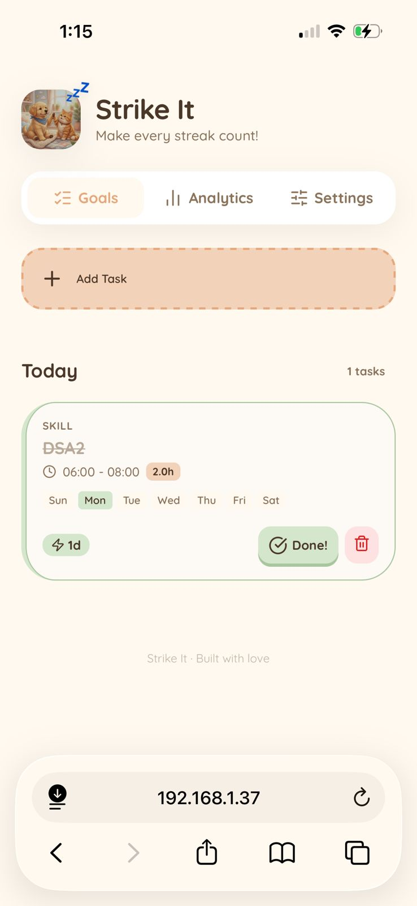
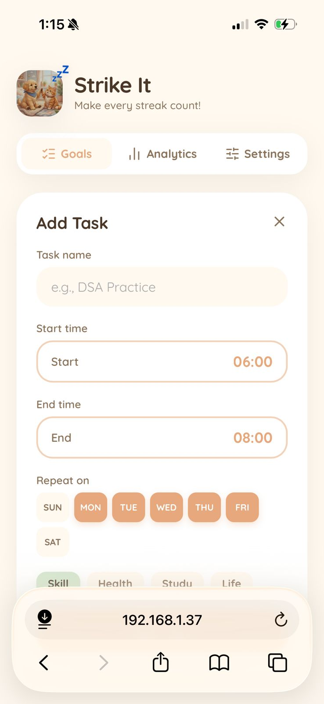
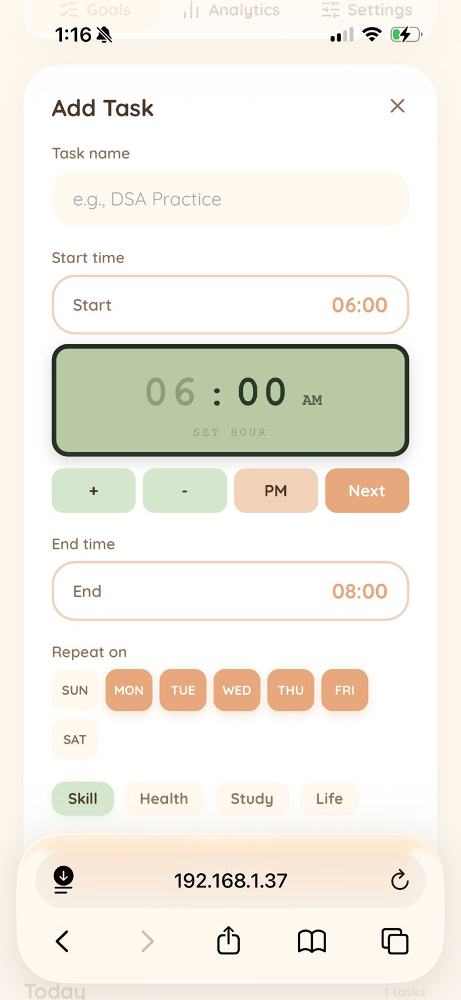
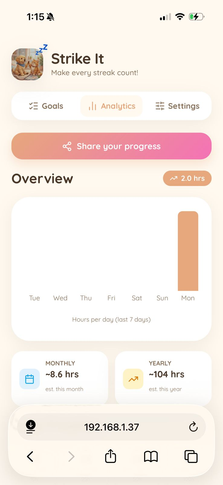
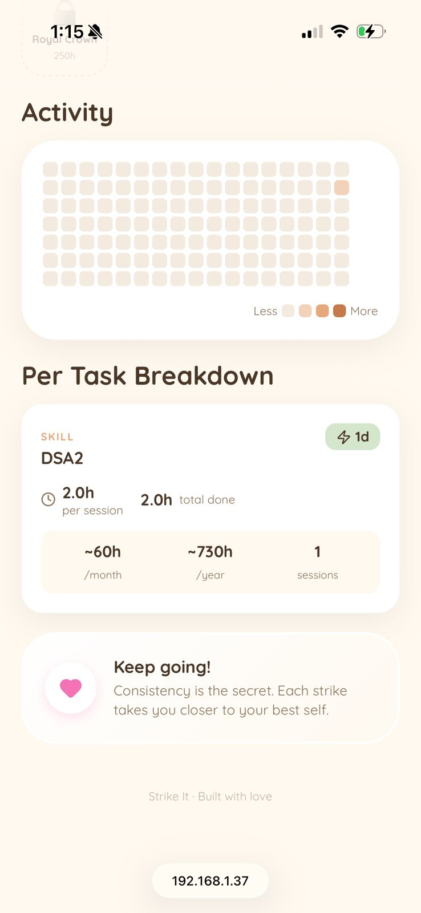
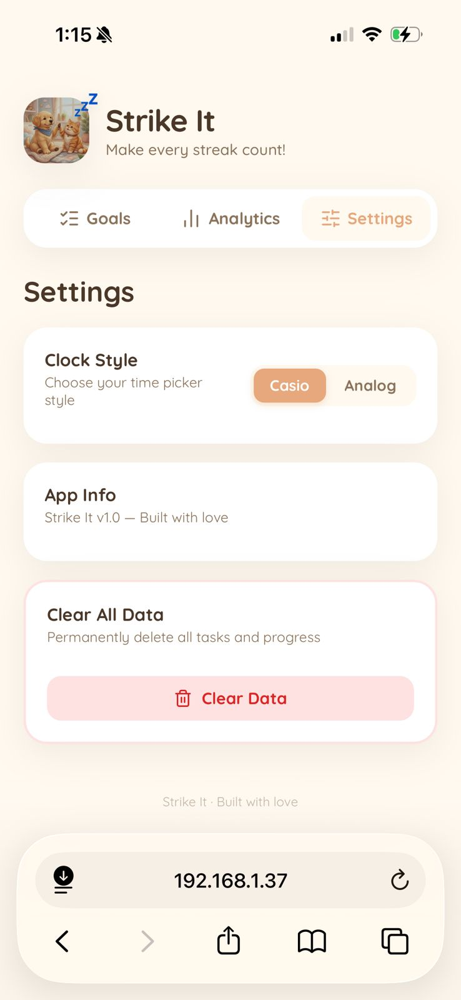
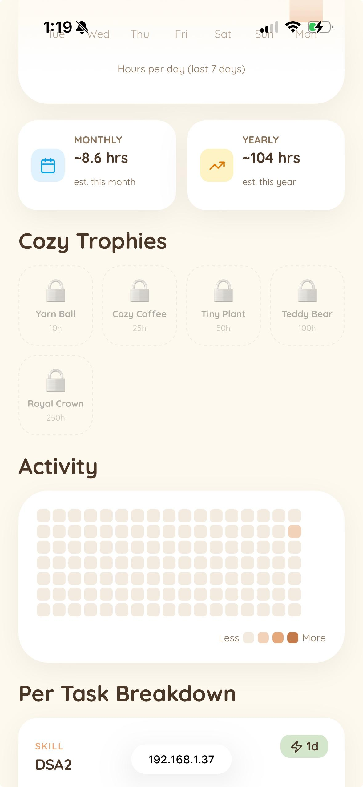

<div align="center">
  
  <h1>Strike It 🐾</h1>
  <p><strong>Make every streak count! A cozy, cute, and delightfully aesthetic task & habit tracker.</strong></p>

  <p>
    ✨ <strong>Vibe coded by smil using Antigravity Editor and Gemni 3.1pro + opus 4.6 modals</strong>
  </p>
</div>

---

**Strike It** is a mobile-first Progressive Web App (PWA) built to make habit tracking feel less like a chore and more like a cozy game. Instead of sterile checklists, you are greeted by soft caramel aesthetics, satisfying confetti micro-interactions, an adorable dynamic mascot, and an unlockable Trophy Room to reward your consistency! 

## 📸 Screenshots

| Main Goals & Mascot | Adding a Task | Casio-Style Time Picker |
| :---: | :---: | :---: |
|  |  |  |

| Analytics & Projections | Activity Map & Breakdown | Trophy Room & Settings |
| :---: | :---: | :---: |
|  |  |  |
|  | *(Activity Map Extended)* | *(Trophies continued)* |

---

## ✨ Features

- **No Login Required**: Jump straight into productivity. Your data is yours, stored exclusively on your device.
- **Cozy & Aesthetic UI**: A warm "Cream & Caramel" color palette with smooth, spring-based animations powered by `framer-motion`.
- **Mascot Moods**: The adorable Strike It mascot reacts to your progress! It sleeps (`💤`) when you have no tasks left, wiggles with joy (`✨`) when you strike a task, and waits patiently when work is pending.
- **Satisfying Strikes**: Hit the "Strike It" button to fire a burst of colorful, aesthetic confetti. Mistakenly struck a task? We've got a beautiful frosted-glass undo prompt to make sure you aren't cheating your progress!
- **Deep Analytics**: 
  - **GitHub-style Heat Map**: Visualize your consistency over the last 16 weeks.
  - **Per-Task Breakdowns**: See how much time you're investing per session, your current streak, and monthly/yearly hour projections.
- **The Cozy Trophy Room**: Your consistency is rewarded! Earn virtual cozy items (🧶 Yarn balls, ☕ Cozy Coffee, 🪴 Tiny Plants) as you accumulate hours. 
- **Shareable Progress**: Generate aesthetic "Share Cards" showing off your best streaks or total hours integrated natively with your phone's share sheet via the Web Share API.
- **Fully Local & Offline**: 100% offline-first PWA using `localStorage`. No cloud syncing required; your data belongs to you.

---

## 🌍 Live Demo & App Installation

Strike It is deployed directly on **GitHub Pages**! 

🔗 **[Visit Strike It Live Here](https://smil-is-vibe-coding.github.io/Strike-it/)**

### How to Install (100% Offline Support 📶)
Strike It is a fully functioning Progressive Web App (PWA). Once you visit the site, you can install it directly to your phone. **And yes, we are absolutely sure it works entirely offline!** Your data will safely stay on your device permanently.

**🍎 For iOS (Safari):**
1. Open the live link in Safari.
2. Tap the **Share** icon at the bottom.
3. Scroll down and tap **"Add to Home Screen"**.
4. Launch Strike It directly from your home screen for a beautiful, full-screen iOS app experience!

**🤖 For Android (Chrome):**
1. Open the live link in Chrome.
2. Tap the **3-dot menu** at the top right.
3. Tap **"Add to Home screen"** or **"Install app"**.
4. Open it from your app drawer!

---

## 🛠️ Tech Stack

- **Framework**: React 19 + TypeScript
- **Bundler**: Vite 8
- **Styling**: Vanilla CSS (CSS Variables for dynamic theming)
- **Animations**: `framer-motion` & `canvas-confetti`
- **Charts**: `recharts` for the analytics dashboard
- **Icons**: `lucide-react`
- **PWA Capabilities**: Custom `sw.js` and `manifest.json` for seamless mobile installation.

---

## 🚀 Running Locally

Want to run Strike It locally or tweak the cuteness?

```bash
# 1. Clone the repository
git clone https://github.com/smil-is-vibe-coding/Strike-it.git

# 2. Enter the directory
cd strike-it

# 3. Install dependencies
npm install

# 4. Start the development server
npm run dev
```

To run on your local network (e.g. to test on your phone via WSL):
```bash
npm run dev -- --host
```

---

## ⚙️ Building for Production

```bash
npm run build
```
The output will be carefully optimized into the `dist/` folder, ready to be deployed to Vercel, Netlify, or any static host!

---

<div align="center">
  <p>Built with love ❤️ at Strike It</p>
</div>
